<!-- ✨ MAYUR SHETTY — Magical Animated GitHub Profile ✨ -->
<!-- 🌊 Full Animated Header: Wave + Name + Badges + Tagline -->

<!-- 📊 Futuristic Animated Stats Dashboard -->

  
  &nbsp;&nbsp;&nbsp;
  
  &nbsp;&nbsp;&nbsp;
  

<!-- 🌈 Animated Rainbow Divider -->

<!-- 🧙‍♂️ About Me — Cyberpunk Agent Profile -->
<h2 align="center">
  
  About the Wizard Behind the Code
  
</h2>

 

  
  &nbsp;&nbsp;&nbsp;&nbsp;
  

 

<!-- 🌈 Animated Rainbow Divider -->

<!-- ⚙️ Tech Universe — Glassmorphic Cyber Grid -->
<h2 align="center">
  
  My Tech Universe
  
</h2>

 

  

<!-- 🌈 Animated Rainbow Divider -->

<!-- 📈 GitHub Stats & Analytics -->
<h2 align="center">
  
  GitHub Stats & Analytics
</h2>

 

  
  &nbsp;&nbsp;&nbsp;
  

 

  

 

<!-- 📊 Activity Graph -->

  

<!-- 🌈 Animated Rainbow Divider -->

<!-- 🏅 GitHub Trophies -->
<h2 align="center">🏅 GitHub Trophies</h2>

  

<!-- 🌈 Animated Rainbow Divider -->

<!-- 🐍 Contribution Snake Animation -->
<h2 align="center">🐍 Watch the Snake Eat My Contributions</h2>

  <picture>
    <source media="(prefers-color-scheme: dark)" srcset="https://raw.githubusercontent.com/mayurshetty100/mayurshetty100/output/github-snake-dark.svg" />
    <source media="(prefers-color-scheme: light)" srcset="https://raw.githubusercontent.com/mayurshetty100/mayurshetty100/output/github-snake.svg" />
    
  </picture>

<!-- 🌈 Animated Rainbow Divider -->

<!-- 🎓 Certifications & Achievements -->
<h2 align="center">
  
  Certifications & Achievements
</h2>

<!-- 🏆 Top Achievements Badges -->

  
  &nbsp;
  
  &nbsp;
  

 

<h3 align="center">📜 View All 19 Tech Certifications ▼</h3>

 

| # | Certification | Status |
|:-:|:---|:---:|
| 1 | 🎨 Canva Design | ✅ Certified |
| 2 | 🎭 Figma UI/UX | ✅ Certified |
| 3 | 🔄 Git & GitHub | ✅ Certified |
| 4 | 🌐 HTML & CSS | ✅ Certified |
| 5 | ☕ Java Programming | ✅ Certified |
| 6 | ⚡ JavaScript | ✅ Certified |
| 7 | 🍃 MongoDB | ✅ Certified |
| 8 | 🐬 MySQL | ✅ Certified |
| 9 | 🟢 Node.js | ✅ Certified |
| 10 | 🐍 Python | ✅ Certified |
| 11 | ⚛️ React.js | ✅ Certified |
| 12 | 🎨 Tailwind CSS | ✅ Certified |
| 13 | 📮 Postman API Student Expert | ✅ Certified |
| 14 | 🤖 Gen AI 101 with Pieces | ✅ Certified |
| 15 | 🧠 Prompt Engineering | ✅ Certified |
| 16 | 📱 Instagram Clone (Figma) | ✅ Certified |
| 17 | 💡 Emotional Intelligence | ✅ Certified |
| 18 | 🎤 Public Speaking | ✅ Certified |
| 19 | 🤝 People Skills for Professional Success | ✅ Certified |

 

<h3 align="center">🏅 View All Achievements & Awards ▼</h3>

 

| # | Achievement | Highlight |
|:-:|:---|:---:|
| 1 | 🏆 ACPC AlgoHour | **4th Place in India** 🇮🇳 |
| 2 | 🥇 ACM Javathon | **Top 5 Teams Appreciation** |
| 3 | 💼 InternPE Internship | **Completion Certificate** |
| 4 | 🌟 Naukri Campus Young Turks | **Merit Certificate** |
| 5 | 🗣️ EnglishBolo Level 3 | **Professional Certificate** |
| 6 | 🎮 22 Yards of Code | Participation |
| 7 | 🎲 ACM Game of Codes | Participation |
| 8 | 📱 ACM Javathon | Participation |
| 9 | 🏢 BrandQuest | Participation |
| 10 | ⚡ Thrizll | Participation |

<!-- 🌈 Animated Rainbow Divider -->

<!-- 🏆 Programming Profiles -->
<h2 align="center">🏆 Programming Profiles</h2>

  
  &nbsp;&nbsp;
  

<!-- 🌈 Animated Rainbow Divider -->

<!-- 🌐 Connect With Me -->
<h2 align="center">
  
  Let's Connect & Build Together
  
</h2>

  
  &nbsp;
  
  &nbsp;
  
  &nbsp;
  
  &nbsp;
  

<!-- 🌈 Animated Rainbow Divider -->

<!-- 💭 Random Dev Quote -->
<h2 align="center">💭 Random Dev Wisdom</h2>

  

<!-- 🌈 Animated Rainbow Divider -->

<!-- ✨ Magical Outro -->
<h2 align="center">✨ The Journey Never Ends ✨</h2>

  

  
  &nbsp;&nbsp;&nbsp;
  
  &nbsp;&nbsp;&nbsp;
  

 

  

<!-- 🌊 Animated Wave Footer -->

