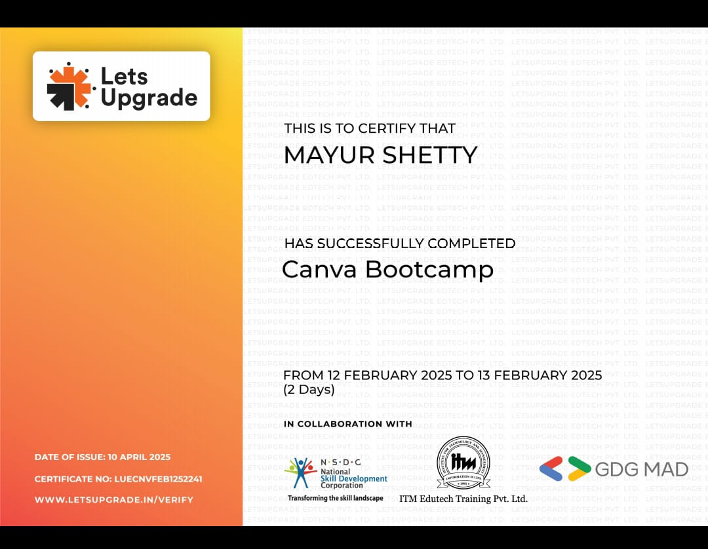
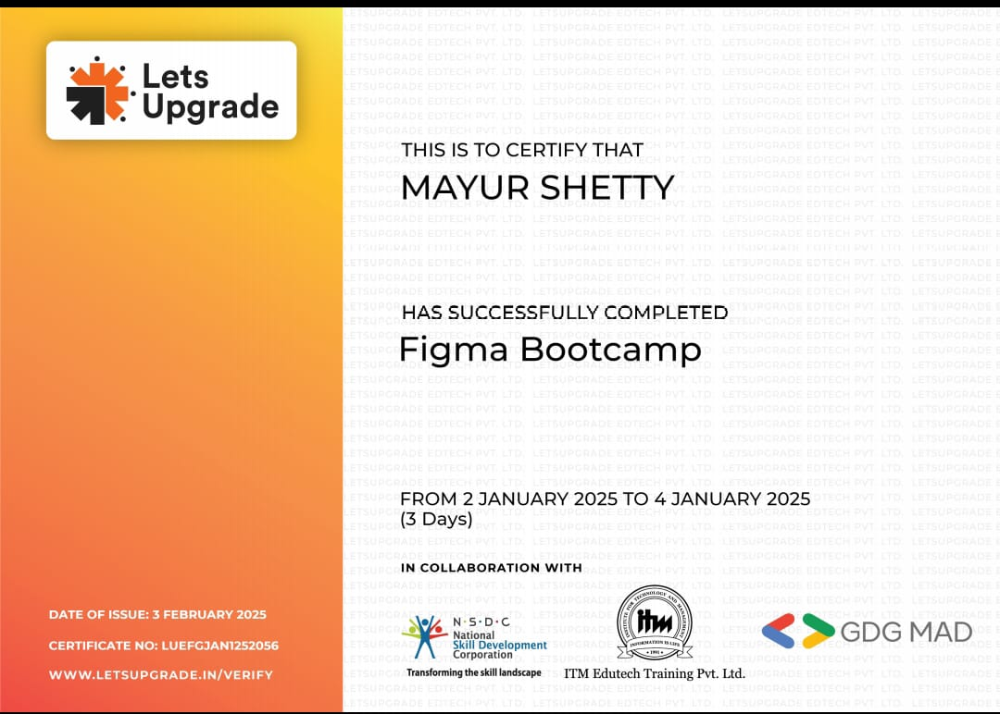
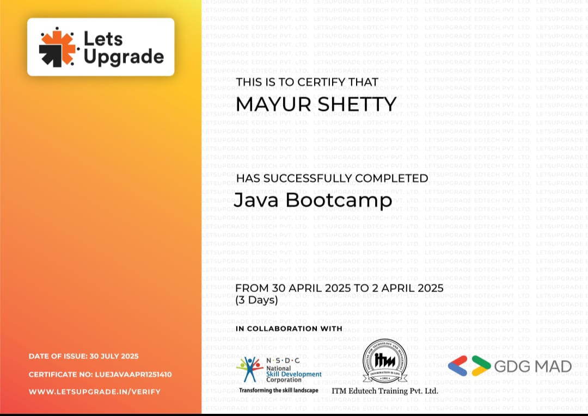
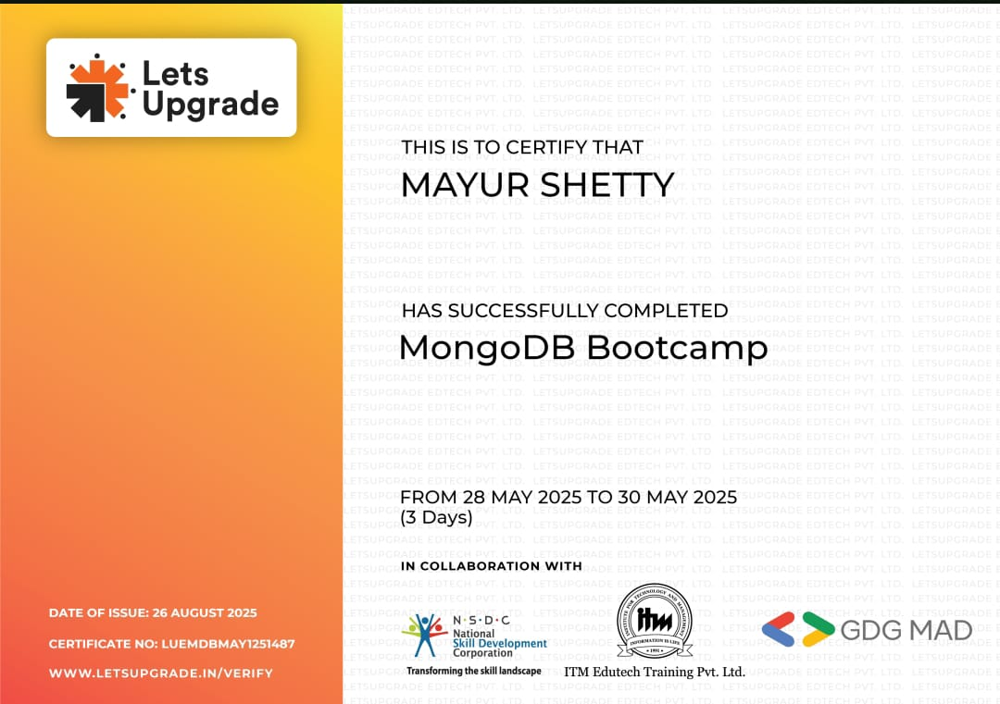
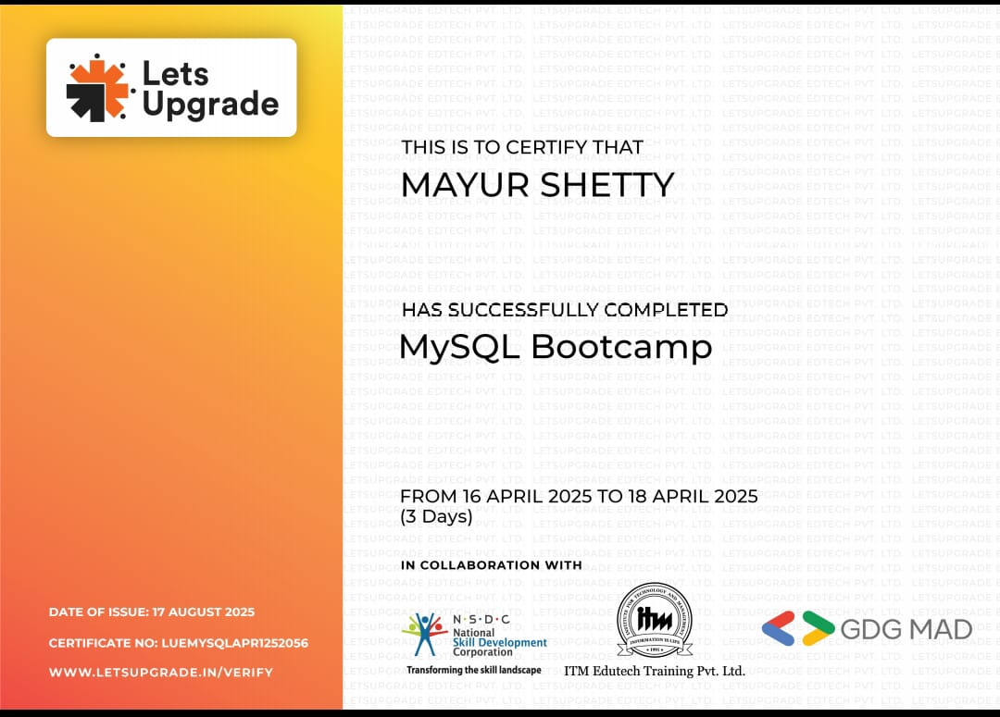
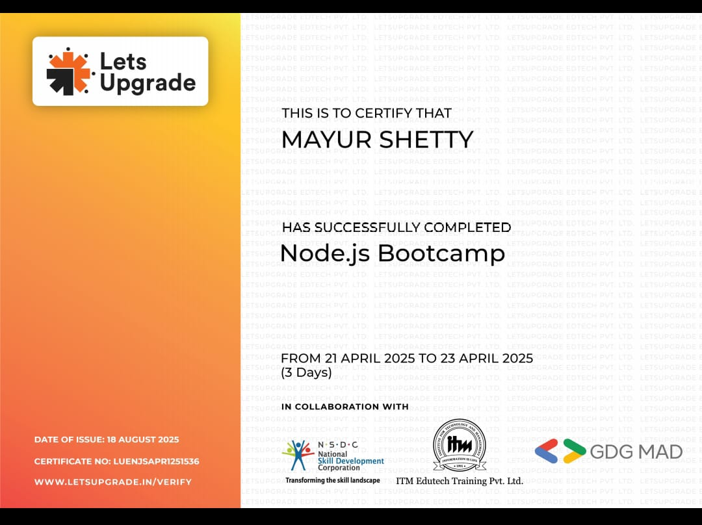
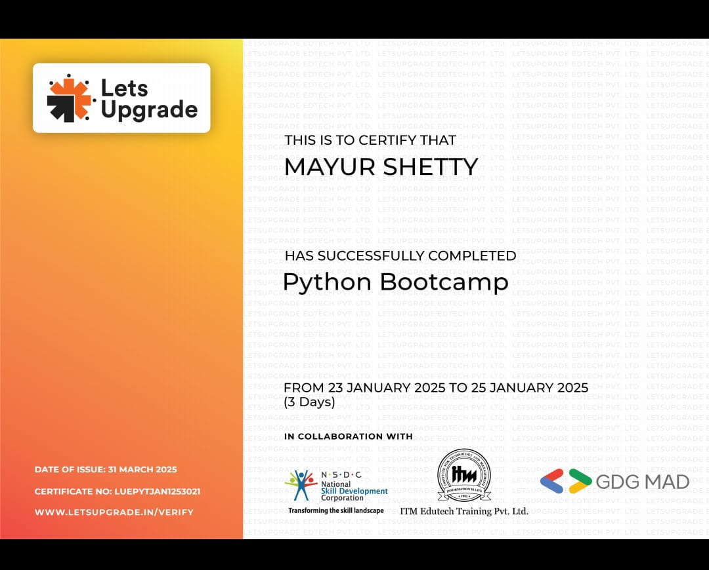
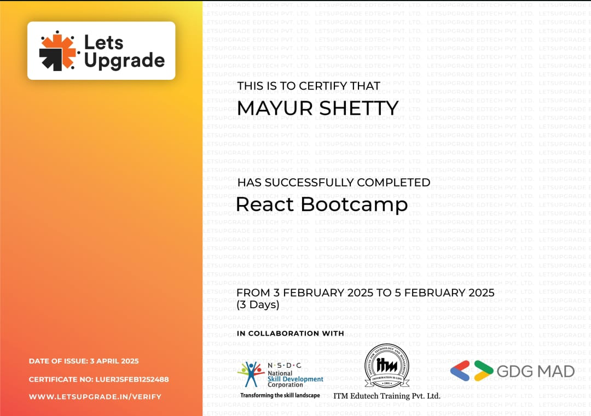

<!-- 🌌 MAYUR SHETTY - Animated Header Section -->

<h1 align="center">
  
</h1>

  

---

<!-- 🌌 My Tech Universe Section -->

<h2 align="center">⚙️ My Tech Universe 🌐</h2>

  
  
  
  
  
  
  
  
  
  
  
  
  
  
  
  
  
  
  
  
  
  
  
  
  
  
  
  

---

<!-- 🧠 Programming Profiles Section -->
<h2 align="center">🏆 Programming Profiles</h2>

  
  

---

<!-- 🌐 Find Me On Section -->
<h2 align="center">🌐 Find Me On</h2>

  
  
  
  
  

---

<!-- 🏆 GitHub Trophies Section -->
<h2 align="center">🏅 GitHub Trophies</h2>

  

---

<!-- 📊 GitHub Stats Section -->
<h2 align="center">📈 GitHub Stats & Analytics</h2>

  <!-- GitHub Stats -->
  
  
  <!-- GitHub Streak -->
  

<!-- 🔵 GitHub Languages -->

  

---

<!-- 🏆 Milestones Section -->
<h2 align="center">🚀 Milestones</h2>

   &nbsp;&nbsp;
  &nbsp;&nbsp;
  &nbsp;&nbsp;
  &nbsp;&nbsp;
  &nbsp;&nbsp;
  &nbsp;&nbsp;
  &nbsp;&nbsp;
  &nbsp;&nbsp;
  &nbsp;&nbsp;

---

<!-- 💼 Credentials Section -->
<h2 align="center">💼 Credentials</h2>

  
  
  
  
  
  
  
  
  
  
  
  
  
  
  
  
  

---

<!-- 💫 Rizz-Filled Outro Section -->
<h2 align="center">✨ The Journey Never Ends ✨</h2>

  

