<!-- ✨ MAYUR SHETTY — Magical Animated GitHub Profile ✨ -->
<!-- 🌊 Full Animated Header: Wave + Name + Badges + Tagline -->

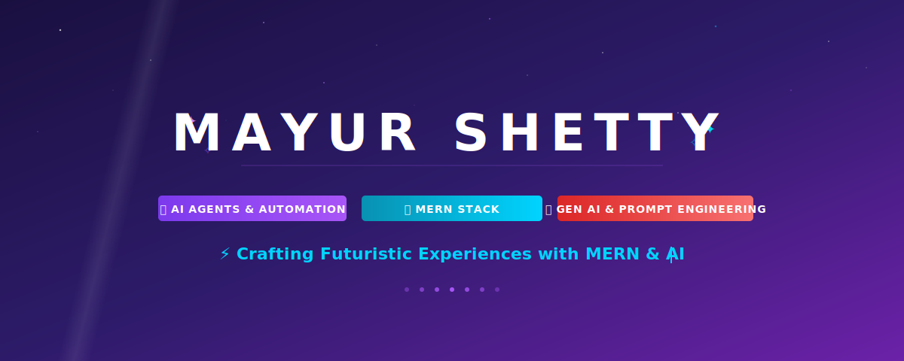

<!-- 📊 Live Stats Dashboard -->

  
  &nbsp;&nbsp;&nbsp;
  
  &nbsp;&nbsp;&nbsp;
  

<!-- 🌈 Animated Rainbow Divider -->

<!-- 🧙‍♂️ About Me — Cyberpunk Agent Profile -->
<h2 align="center">
  
  About the Wizard Behind the Code
  
</h2>

 

  <a href="#">
    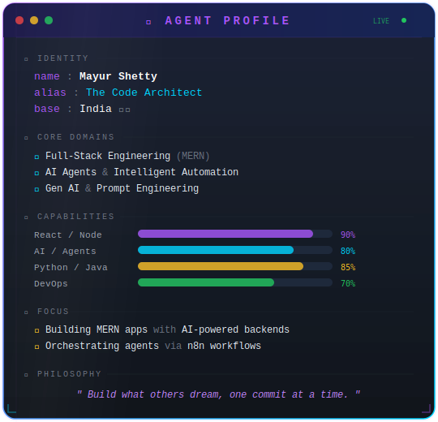
  </a>
  &nbsp;&nbsp;&nbsp;&nbsp;
  <a href="#">
    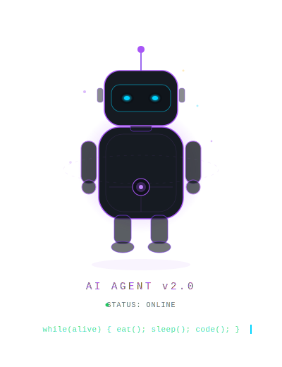
  </a>

 

<!-- 🌈 Animated Rainbow Divider -->

<!-- ⚙️ Tech Universe — Glassmorphic Cyber Grid -->
<h2 align="center">
  
  My Tech Universe
  
</h2>

 

  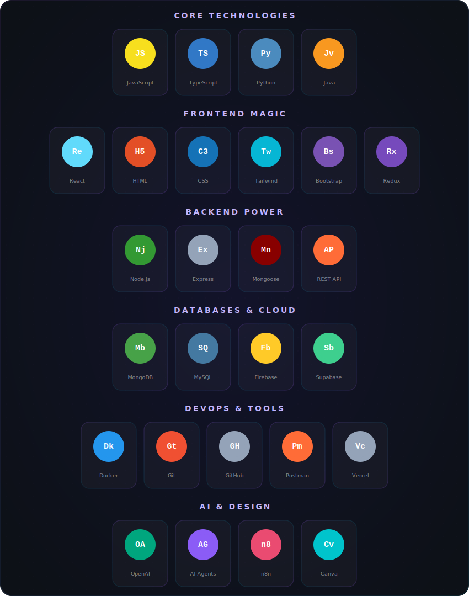

<!-- 🌈 Animated Rainbow Divider -->

<!-- 📈 GitHub Stats & Analytics — Futuristic Dashboard -->

  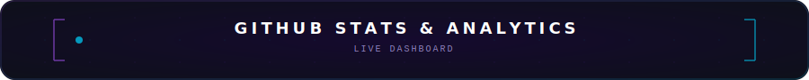

 

<!-- 🔥 Streak Dashboard — Full Width -->

  

  

<!-- 📊 Stats + Top Languages Side by Side -->

  
  &nbsp;&nbsp;&nbsp;
  

  

<!-- 📈 Activity Graph -->

  

<!-- 🌈 Animated Rainbow Divider -->

<!-- 🏅 GitHub Trophies -->

  

 

  

<!-- 🌈 Animated Rainbow Divider -->

<!-- 🐍 Contribution Snake Animation -->
<h2 align="center">🐍 Watch the Snake Eat My Contributions</h2>

  <picture>
    <source media="(prefers-color-scheme: dark)" srcset="https://raw.githubusercontent.com/mayurshetty100/mayurshetty100/output/github-snake-dark.svg" />
    <source media="(prefers-color-scheme: light)" srcset="https://raw.githubusercontent.com/mayurshetty100/mayurshetty100/output/github-snake.svg" />
    
  </picture>

<!-- 🌈 Animated Rainbow Divider -->

<!-- 🏆 Programming Profiles -->
<h2 align="center">
  
  Programming Profiles
  
</h2>

  <a href="https://leetcode.com/u/Mayur_Shetty_100/" target="_blank">
    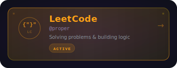
  </a>
  &nbsp;
  <a href="https://www.codechef.com/users/mayurshetty" target="_blank">
    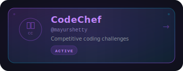
  </a>

<!-- 🌈 Animated Rainbow Divider -->

<!-- 🌐 Connect With Me -->
<h2 align="center">
  
  Let's Connect & Build Together
  
</h2>

  
  
  <a href="https://www.instagram.com/wanna.rizz.up" target="_blank">
    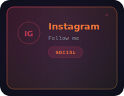
  </a>
  <a href="https://x.com/mayurshetty100" target="_blank">
    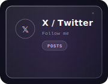
  </a>

<!-- 🌈 Animated Rainbow Divider -->

<!-- � DEV RIZZ -->
<h2 align="center">
  😏🔥 DEV RIZZ 🔥😏
</h2>

  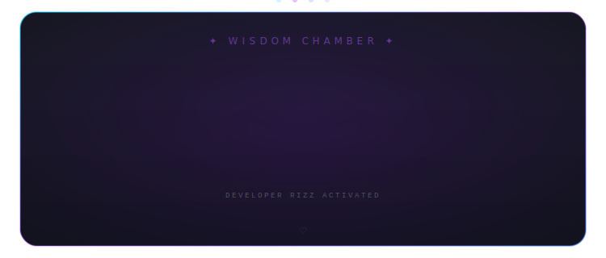

<!-- 🌈 Animated Rainbow Divider -->

<!-- Core Fusion — Cinematic Outro -->
 

  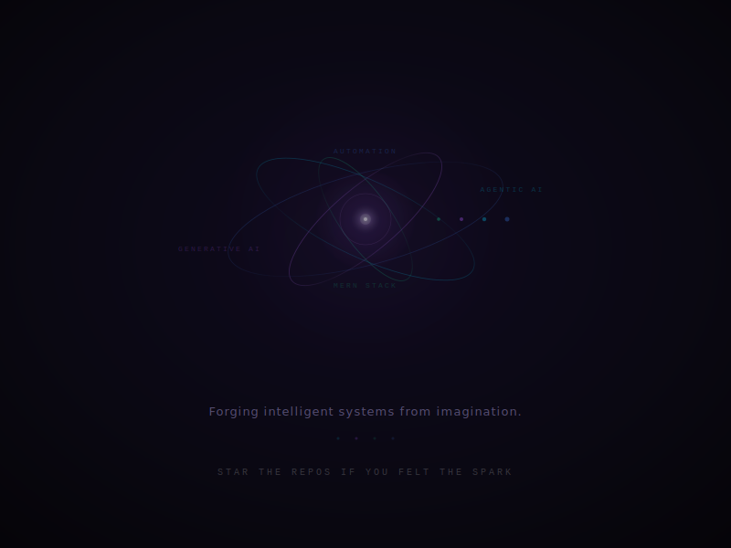

 
