# 🚀 Futuristic GitHub Profile Setup Guide

Complete instructions to deploy your animated GitHub profile README with all assets.

---

## 📋 Table of Contents

1. [Quick Start](#quick-start)
2. [File Structure](#file-structure)
3. [Placeholder Replacements](#placeholder-replacements)
4. [Asset Customization](#asset-customization)
5. [Deployment Steps](#deployment-steps)
6. [Advanced Features](#advanced-features)
7. [Troubleshooting](#troubleshooting)

---

## ⚡ Quick Start

### 1. Required Files Already Created:

✅ `/README.md` - Main profile page (with placeholders)
✅ `/assets/header.svg` - Animated header with circular photo
✅ `/assets/tech-universe.svg` - Orbiting tech stack icons
✅ `/assets/projects-carousel.svg` - Rotating projects showcase

### 2. Immediate Actions:

```bash
# 1. Navigate to your repo root
cd /path/to/mayurshetty100

# 2. Verify assets are in place
ls -la assets/

# 3. Replace placeholders in README.md (see section below)

# 4. Commit and push
git add .
git commit -m "🚀 Add futuristic animated GitHub profile"
git push origin main
```

---

## 📁 File Structure

After setup, your repository should look like:

```
mayurshetty100/
├── README.md                           # Main profile (with placeholders)
├── assets/
│   ├── header.svg                     # Animated header (photo + name + tagline)
│   ├── tech-universe.svg              # Orbiting tech icons
│   ├── projects-carousel.svg          # Rotating projects carousel
│   └── profile-photo.jpg              # (Optional) Your circular photo
├── .github/
│   └── workflows/
│       └── update-readme.yml          # (Optional) Auto-update stats
└── cv/
    └── resume.pdf                     # (Optional) Your CV
```

---

## 🔄 Placeholder Replacements

Replace all `{{PLACEHOLDER}}` values in `README.md`:

### Profile Information

| Placeholder | Example | Location |
|------------|---------|----------|
| `{{NAME}}` | Mayur Shetty | Line 2 (header.svg alt text), About Me section |
| `{{TAGLINE}}` | Full-Stack Developer & AI Enthusiast | header.svg (built-in as "MAYUR") |
| `{{PHOTO-URL}}` | `https://avatars.githubusercontent.com/u/YOUR_ID?v=4` | Inside header.svg |
| `{{GITHUB-USERNAME}}` | mayurshetty100 | Multiple locations (GitHub stats, links) |
| `{{EMAIL}}` | your.email@example.com | Footer contact section |

### Social Links & Profiles

| Placeholder | Example |
|------------|---------|
| `{{CODECHEF-URL}}` | `https://www.codechef.com/users/yourusername` |
| `{{LEETCODE-URL}}` | `https://leetcode.com/u/yourusername` |
| `{{LINKEDIN-URL}}` | `https://linkedin.com/in/yourprofile` |
| `{{TWITTER-URL}}` | `https://twitter.com/yourhandle` |
| `{{INSTAGRAM-URL}}` | `https://instagram.com/yourhandle` |

### Project Links

| Placeholder | Example |
|------------|---------|
| `{{PROJECT1-REPO}}` | `https://github.com/mayurshetty100/project-alpha` |
| `{{PROJECT2-REPO}}` | `https://github.com/mayurshetty100/project-beta` |
| `{{PROJECT3-REPO}}` | `https://github.com/mayurshetty100/project-gamma` |

### Additional Resources

| Placeholder | Example |
|------------|---------|
| `{{CV-URL}}` | `https://github.com/mayurshetty100/cv/resume.pdf` |

### Quick Replace Script (Bash)

```bash
#!/bin/bash

# Update all placeholders at once
sed -i 's/{{NAME}}/Mayur Shetty/g' README.md
sed -i 's/{{GITHUB-USERNAME}}/mayurshetty100/g' README.md
sed -i 's/{{EMAIL}}/mayur@example.com/g' README.md
sed -i 's|{{PHOTO-URL}}|https://avatars.githubusercontent.com/u/YOUR_ID?v=4|g' assets/header.svg
sed -i 's|{{CODECHEF-URL}}|https://www.codechef.com/users/mayurshetty100|g' README.md
sed -i 's|{{LEETCODE-URL}}|https://leetcode.com/u/mayurshetty|g' README.md
sed -i 's|{{LINKEDIN-URL}}|https://linkedin.com/in/mayurshetty|g' README.md
sed -i 's|{{TWITTER-URL}}|https://twitter.com/mayurshetty|g' README.md
sed -i 's|{{INSTAGRAM-URL}}|https://instagram.com/mayurshetty|g' README.md
sed -i 's|{{PROJECT1-REPO}}|https://github.com/mayurshetty100/project-alpha|g' README.md
sed -i 's|{{PROJECT2-REPO}}|https://github.com/mayurshetty100/project-beta|g' README.md
sed -i 's|{{PROJECT3-REPO}}|https://github.com/mayurshetty100/project-gamma|g' README.md
sed -i 's|{{CV-URL}}|https://github.com/mayurshetty100/cv/resume.pdf|g' README.md

echo "✅ All placeholders replaced!"
```

---

## 🎨 Asset Customization

### 1. Update Your Photo in header.svg

**Option A: Direct URL (Recommended)**

In `header.svg`, find this line:

```xml
<image xlink:href="{{PHOTO-URL}}" x="55" y="55" width="190" height="190" clip-path="circle(95px at 150px 150px)" preserveAspectRatio="xMidYMid slice"/>
```

Replace `{{PHOTO-URL}}` with your profile photo URL:

```xml
<image xlink:href="https://avatars.githubusercontent.com/u/YOUR_GITHUB_ID?v=4" x="55" y="55" width="190" height="190" clip-path="circle(95px at 150px 150px)" preserveAspectRatio="xMidYMid slice"/>
```

**Option B: Base64 Embed (For offline reliability)**

1. Convert your image to Base64: [Base64 Converter](https://base64.guru/converter/encode/image)
2. Replace the xlink:href with:

```xml
<image xlink:href="data:image/jpeg;base64,/9j/4AAQSkZJRg..." .../>
```

### 2. Customize Tech Stack Icons in tech-universe.svg

To change icons, find the orbit sections and modify:

```xml
<!-- Example: Replace Node.js with different tech -->
<g transform="translate(150, 0)">
  <circle cx="0" cy="0" r="32" fill="#NEW_COLOR" class="icon"/>
  <text x="0" y="-6" font-size="20" text-anchor="middle">ICON</text>
</g>
```

### 3. Update Project Cards in projects-carousel.svg

Edit each project card (Alpha, Beta, Gamma) to match your projects:

```xml
<text x="110" y="50" font-size="18" font-weight="bold" fill="#00d4ff" text-anchor="middle">
  Your Project Name Here
</text>
```

---

## 📤 Deployment Steps

### Step 1: Save All Files

Ensure all files are in your repository:

```bash
# Verify structure
tree -L 2 mayurshetty100/

# Should output:
# mayurshetty100/
# ├── README.md
# ├── assets/
# │   ├── header.svg
# │   ├── tech-universe.svg
# │   └── projects-carousel.svg
# └── ...
```

### Step 2: Test Locally (Optional)

Use a local markdown renderer to preview:

```bash
# Using Python (if installed)
python -m http.server 8000

# Then open: http://localhost:8000/README.md
```

Or use GitHub's preview by pushing to a test branch first.

### Step 3: Replace All Placeholders

Edit `README.md` and `assets/header.svg` with your actual information:

```bash
# Use find-and-replace in your editor:
# - Search: {{GITHUB-USERNAME}}
# - Replace: mayurshetty100
# (Repeat for all placeholders)
```

### Step 4: Commit and Push

```bash
# Add all files
git add README.md assets/

# Commit with a meaningful message
git commit -m "🚀 Add futuristic animated GitHub profile with SVG assets"

# Push to main branch
git push origin main
```

### Step 5: Verify on GitHub

1. Go to: `https://github.com/{{GITHUB-USERNAME}}`
2. Your profile should now display:
   - ✨ Animated header with photo
   - 🌌 Orbiting tech stack
   - 📊 GitHub stats
   - 🚀 Rotating projects
   - 🔗 Social links

---

## 🔮 Advanced Features

### A. Auto-Update GitHub Stats with GitHub Actions

Create `.github/workflows/update-readme.yml`:

```yaml
name: Update README

on:
  schedule:
    - cron: '0 0 * * 0'  # Weekly on Sunday
  workflow_dispatch:

jobs:
  update:
    runs-on: ubuntu-latest
    steps:
      - uses: actions/checkout@v3
      
      - name: Generate new stats
        run: |
          echo "Stats auto-updated at $(date)" >> README.md
      
      - name: Commit changes
        run: |
          git config --local user.email "action@github.com"
          git config --local user.name "GitHub Action"
          git add README.md
          git commit -m "📊 Update README stats" || exit 0
      
      - name: Push changes
        uses: ad-m/github-push-action@master
        with:
          github_token: ${{ secrets.GITHUB_TOKEN }}
```

### B. Host Static Website with GitHub Pages

To enable interactive carousel and animations:

1. Create `docs/index.html`:

```html
<!DOCTYPE html>
<html lang="en">
<head>
    <meta charset="UTF-8">
    <meta name="viewport" content="width=device-width, initial-scale=1.0">
    <title>Mayur Shetty - Portfolio</title>
    <style>
        body {
            background: linear-gradient(135deg, #0a0e27 0%, #1a1a3e 100%);
            font-family: 'Courier New', monospace;
            color: #00d4ff;
            overflow-x: hidden;
        }
        .container { max-width: 1200px; margin: 0 auto; padding: 20px; }
        .carousel { cursor: pointer; }
    </style>
</head>
<body>
    <div class="container">
        <h1>Portfolio Website</h1>
        <object data="../assets/header.svg" type="image/svg+xml" width="100%"></object>
    </div>
</body>
</html>
```

2. In GitHub repo settings:
   - Go to **Settings → Pages**
   - Source: `main` branch `/docs` folder
   - Your site will be live at: `https://mayurshetty100.github.io`

### C. Add a Projects Subpage

Create `projects.md`:

```markdown
# 🚀 Featured Projects



## Project Alpha
- **Description:** High-performance MERN app
- **Live Demo:** [View Live](https://project-alpha-demo.com)
- **Repository:** [GitHub](https://github.com/mayurshetty100/project-alpha)

## Project Beta
- **Description:** AI-powered recommendation engine
- **Repository:** [GitHub](https://github.com/mayurshetty100/project-beta)

## Project Gamma
- **Description:** Full-stack SaaS platform
- **Repository:** [GitHub](https://github.com/mayurshetty100/project-gamma)
```

---

## 🐛 Troubleshooting

### Issue 1: SVGs Not Rendering on GitHub

**Symptom:** SVG files show as broken images

**Solution:**

```markdown
<!-- Instead of: -->


<!-- Use: -->

```

### Issue 2: Animations Not Playing

**Symptom:** SVGs appear static

**Cause:** Some browsers block animations in embedded SVGs

**Solution:**

```xml
<!-- Add this to your SVG <head>: -->
<style>
  @import url('https://fonts.googleapis.com/css2?family=Courier+New:wght@400;700&display=swap');
  /* Animation styles are already embedded in your SVGs */
</style>
```

### Issue 3: Photo Not Displaying

**Symptom:** Only initials visible in circular frame

**Solution:** 

1. Verify the photo URL is public and accessible
2. Use a direct GitHub Avatar URL: `https://avatars.githubusercontent.com/u/YOUR_GITHUB_ID?v=4`
3. Test URL in browser to ensure it loads

### Issue 4: Stats Cards Not Updating

**Symptom:** GitHub stats show error or old data

**Solution:**

```markdown
<!-- Ensure correct theme is used: -->
[](...)

<!-- Verify service availability: -->
<!-- Visit: https://github-readme-stats.vercel.app -->
```

### Issue 5: Mobile View Not Responsive

**Solution:** The SVGs are responsive by default. If not working:

```markdown
<div align="center">
  
</div>
```

---

## ✅ Verification Checklist

Before considering your profile complete:

- [ ] README.md displays without errors
- [ ] Header SVG shows with animated entrance
- [ ] Circular photo appears in the header
- [ ] Tech stack icons orbit smoothly
- [ ] GitHub stats cards load and display data
- [ ] All social links are clickable
- [ ] Project carousel shows 3 cards
- [ ] Mobile view is responsive
- [ ] All placeholders replaced with real data
- [ ] Footer contact section is functional

---

## 🎯 Next Steps

1. **Customize Colors:** Edit hex color codes in SVG files for your brand
2. **Add Projects:** Update projects carousel with your real projects
3. **Track Analytics:** Use GitHub's built-in insights
4. **Pin Important Repos:** Feature your best work prominently
5. **Keep Updated:** Update GitHub stats quarterly

---

## 📚 Resources

- [GitHub Markdown Guide](https://docs.github.com/en/get-started/writing-on-github)
- [SVG Animation Guide](https://developer.mozilla.org/en-US/docs/Web/SVG/SVG_animation_with_SMIL)
- [github-readme-stats](https://github.com/anuraghazra/github-readme-stats)
- [Badges Generator](https://shields.io/)
- [GitHub Profile Ideas](https://github.com/awesome-selfhosted/awesome-selfhosted)

---

## 💡 Pro Tips

1. **Consistent Branding:** Keep the same color scheme across all sections
2. **Regular Updates:** Update project links quarterly as you complete new work
3. **SEO Friendly:** Include relevant keywords in your "About Me" section
4. **Profile Picture:** Use a professional, high-quality circular photo (min 400x400px)
5. **Engagement:** Add a "Contact" or "Collaborate" CTA to encourage connections

---

**Created with ❤️ | Last Updated: 2024**

Happy coding! 🚀✨
